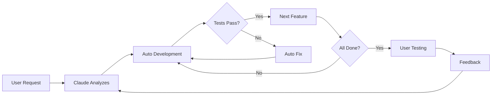

# CLAUDE.md

This file provides guidance to Claude Code (claude.ai/code) when working with code in this repository.

## Project Overview

This is a Chrome extension for YouTube that enhances educational video viewing by:
- Displaying interactive transcripts/subtitles
- Allowing users to click on any word/phrase for instant AI explanations
- Integrating with ChatGPT for contextual Q&A
- Showing annotations and detailed explanations as overlays

## Core Features to Implement

1. **YouTube Transcript Extraction**: Get and display video captions/transcripts
2. **Interactive Overlay**: Clickable text overlay synchronized with video
3. **AI Integration**: Connect to ChatGPT API for instant explanations
4. **Smart Annotations**: Show contextual notes and explanations
5. **Learning History**: Track what users clicked and learned

## Architecture Plan

### Chrome Extension Structure
- **Manifest V3**: Modern Chrome extension format
- **Content Script**: Inject UI into YouTube pages
- **Background Service Worker**: Handle API calls and data
- **Popup UI**: Extension settings and controls
- **Storage**: Chrome Storage API for user data

### Technology Stack
- **Language**: TypeScript
- **Build Tool**: Vite or Webpack
- **UI Framework**: React (lightweight for content scripts)
- **Styling**: Tailwind CSS or CSS Modules
- **API**: OpenAI/ChatGPT API

### Key Components Structure
```
educont-extension/
├── src/
│   ├── content/              # Content scripts
│   │   ├── overlay.tsx       # Transcript overlay
│   │   ├── youtube.ts        # YouTube integration
│   │   └── styles.css        # Injected styles
│   ├── background/           # Background service worker
│   │   ├── api.ts           # ChatGPT API calls
│   │   └── storage.ts       # Data management
│   ├── popup/               # Extension popup
│   │   ├── App.tsx          # Settings UI
│   │   └── popup.html       # Popup entry
│   └── common/              # Shared utilities
├── manifest.json            # Extension manifest
└── assets/                  # Icons and images
```

## Development Commands

```bash
# Install dependencies
npm install

# Development build with watch
npm run dev

# Production build
npm run build

# Load extension in Chrome
# 1. Open chrome://extensions/
# 2. Enable Developer mode
# 3. Click "Load unpacked"
# 4. Select the dist/ folder

# Run tests
npm test

# Type checking
npm run type-check

# Linting
npm run lint
npm run lint:fix

# Format code
npm run format
```

## Implementation Priority

1. Set up Chrome extension with Manifest V3
2. Extract YouTube subtitles/transcript
3. Create clickable overlay UI
4. Integrate ChatGPT API
5. Add popup for settings
6. Implement learning history storage
7. Polish UI/UX and animations

## Key Technical Decisions

- Use YouTube's built-in caption API when available
- Fallback to third-party transcript APIs if needed
- Cache AI responses to reduce API costs
- Keep content script lightweight for performance
- Use Chrome Storage API for cross-device sync
- Implement rate limiting for API calls

# Claude Code Development Guidelines

## Project Setup Checklist
- [ ] Define all environment variables upfront in .env.example
- [ ] Create backup strategy before major changes
- [ ] Document hardware configurations with automated setup scripts
- [ ] Set up staging/testing branches
- [ ] Define component boundaries clearly
- [ ] Create infrastructure health checks and fallback configurations
- [ ] Document dependency security monitoring procedures
- [ ] Establish code quality enforcement (ESLint/Prettier configs)

## Development Rules
1. **Incremental Changes**: One feature per development cycle
2. **Working State Preservation**: Commit working states before improvements
3. **Environment Variables**: No hardcoding - use .env for all configurable values
4. **Hardware Documentation**: Record all external system configurations

## Recovery Procedures
- Git stash before major refactoring
- Keep last-known-good commit tags
- Document rollback procedures for each major change

## Memory-Less Development Protocol

### Session Start Checklist (MANDATORY)
1. **Project State Discovery**
   ```bash
   git status
   git log --oneline -5
   git branch -a
   ```
2. **Context Recovery**
   - Read README.md for project overview
   - Check package.json/requirements.txt for dependencies
   - **CRITICAL**: Read PROJECT_STATUS.md or SESSION_HANDOFFS.md if exists
   - Scan for TODO/FIXME comments: `grep -r "TODO\|FIXME" src/`
   - Identify current working branch purpose
3. **Infrastructure Health Check**
   - Run existing tests: `npm test` or equivalent
   - Check if build passes: `npm run build` or equivalent
   - **NEW**: Check for infrastructure issues: `npm run type-check`
   - Verify environment setup: check .env.example
   - **CRITICAL**: Check for security vulnerabilities: `npm audit` or equivalent
   - **NEW**: Verify database connectivity if applicable

### Code Architecture Discovery Protocol
1. **Dependency Analysis**
   ```bash
   # Use Gemini for large codebase analysis
   gemini -p "@./ Analyze the overall architecture, key dependencies, and design patterns used"
   ```
2. **Impact Analysis Before Changes**
   ```bash
   # Analyze specific component dependencies
   gemini -p "@src/[component]/ @tests/ What would be affected if I change this component?"
   ```
3. **Code Style Discovery**
   ```bash
   # Understand existing patterns
   gemini -p "@src/ What coding patterns, naming conventions, and architectural decisions are used?"
   ```

### Professional Code Quality Protocol

#### Pre-Development Checklist
- [ ] Understand existing code patterns and conventions
- [ ] Identify all dependencies of target component
- [ ] Check test coverage for areas to be modified
- [ ] Verify linting and formatting rules

#### During Development
1. **Follow Existing Patterns**: Never introduce new patterns without justification
2. **Type Safety**: Use TypeScript/type hints consistently
3. **Error Handling**: Implement comprehensive error handling
4. **Documentation**: Update docstrings/comments for complex logic
5. **Testing**: Write tests for new functionality

#### Code Change Safety Net
```bash
# Before any major change
git add -A
git commit -m "checkpoint: before [feature] implementation"

# Run full test suite
npm test || pytest || cargo test

# Check linting
npm run lint || flake8 || cargo clippy
```

### Incremental Development Rules
1. **Single Atomic Changes**: One feature/fix per session
2. **Working State Preservation**: Always commit working states
3. **Documentation-Driven**: Update docs as you code
4. **Test-First Approach**: Write/update tests before implementation

### Environment Variable Management
- **Never hardcode**: All configurable values in .env
- **Document all vars**: Keep .env.example updated
- **Type validation**: Validate env vars at startup
- **Fallback values**: Provide sensible defaults

## Infrastructure Automation & Fallback Strategy

### Critical Infrastructure Setup Rules
1. **Database Setup Must Be Automated**
   ```bash
   # Create setup scripts for all infrastructure dependencies
   # Example: setup-database.sh
   #!/bin/bash
   if command -v docker &> /dev/null; then
     docker run --name project-db -e POSTGRES_USER=user -e POSTGRES_PASSWORD=pass -e POSTGRES_DB=app -p 5432:5432 -d postgres:15
   elif command -v createdb &> /dev/null; then
     createdb app && psql app -c "CREATE USER user WITH PASSWORD 'pass';"
   else
     echo "ERROR: No database solution available. Install Docker or PostgreSQL"
     exit 1
   fi
   ```

2. **ESLint/Prettier Auto-Configuration**
   ```bash
   # Never start development without code quality tools
   if [ ! -f .eslintrc.js ] && [ ! -f .eslintrc.json ]; then
     npm init @eslint/config --yes
     echo "✅ ESLint configured automatically"
   fi
   ```

3. **Fallback Configurations**
   - Database: PostgreSQL → SQLite → In-memory
   - Package Manager: npm → yarn → pnpm
   - Testing: Jest → Vitest → Node test runner

### Security Vulnerability Monitoring
```bash
# MANDATORY security check at session start
npm audit --audit-level high || {
  echo "⚠️ High-severity vulnerabilities found!"
  echo "Run: npm audit fix --force"
  echo "Document any unfixable issues in SECURITY_ISSUES.md"
}
```

### Hardware/External System Documentation
Document hardware configs, network settings, dependencies, and credentials with fallback configurations.

### Error Recovery Patterns
1. **Before Major Refactoring**
   ```bash
   git tag working-state-$(date +%Y%m%d-%H%M)
   git stash push -m "pre-refactor backup"
   ```
2. **If Things Break**
   ```bash
   git reset --hard working-state-[timestamp]
   # or
   git stash pop
   ```

### Communication with Future Sessions
- **Commit Messages**: Detailed, explain WHY not just WHAT
- **TODO Comments**: Include context and priority
- **Progress Tracking**: Update project status in commits
- **Architecture Decisions**: Document in separate ADR files

## Professional Development Flow

### Phase 1: Requirements & Technical Planning (30-40% of time)

#### 1.1 Requirements Clarification
```bash
# Use Gemini for requirements structuring
gemini -p "Help me structure these requirements: [user request]"
```

**Essential Verification Items:**
- [ ] **Functional Requirements**: What must it do?
- [ ] **Non-Functional Requirements**: Performance, security, scalability
- [ ] **Constraints**: Budget, timeline, existing system integration
- [ ] **Success Criteria**: Definition of done

#### 1.2 Technology Stack Selection
Create TDR documents for Frontend, Backend, and Infrastructure choices with reasoning.

#### 1.3 Architecture Design
- **System Architecture Diagram**: Component relationships
- **Data Flow**: Information movement
- **API Design**: Endpoint specifications
- **Security Design**: Authentication/authorization strategy

### Phase 2: Project Foundation (20-25% of time)

#### 2.1 Development Environment Setup
```bash
mkdir project-name && cd project-name && git init
touch .env.example README.md CLAUDE.md PROJECT_STATUS.md
```

#### 2.2 Essential Files Creation
- **README.md**: Project overview, setup instructions
- **CLAUDE.md**: Development protocol (use existing template)
- **.env.example**: All environment variables defined
- **PROJECT_STATUS.md**: Current state tracking
- **package.json/requirements.txt**: Dependency management

#### 2.3 Quality Assurance Foundation
```bash
# Linting & Formatting
npm install -D eslint prettier
# Testing framework
npm install -D jest @testing-library/react
# Type checking
npm install -D typescript @types/node
```

### Phase 3: Incremental Development (40-50% of time)

#### 3.1 MVP (Minimum Viable Product) Development
```markdown
## MVP Feature List (Priority Order)
1. [ ] Core functionality only
2. [ ] Basic UI (no styling polish)
3. [ ] Essential API endpoints
4. [ ] Basic error handling
5. [ ] Minimal tests for critical paths
```

#### 3.2 Development Cycle (CLAUDE.md Protocol Compliant)
```bash
# Per feature development
1. git checkout -b feature/[feature-name]
2. gemini -p "@./ Analyze impact of adding [feature]"
3. Write tests first
4. Implement feature
5. Run full test suite
6. Code review (self-review with gemini)
7. Merge to main
```

### Phase 4: Optimization & Deployment (remaining time)

#### 4.1 Comprehensive Testing
- **Unit Tests**: Function-level testing
- **Integration Tests**: API integration testing
- **E2E Tests**: User scenario testing

#### 4.2 Production Environment Preparation
```bash
# Infrastructure as Code
# Dockerization
# CI/CD pipeline setup
# Monitoring configuration
```

### Scope Creep Management

#### Change Request Protocol
```bash
gemini -p "@PROJECT_STATUS.md How would adding [new feature] impact current design?"
echo "Change Request: [details] - Impact: [H/M/L] - Timeline: [+X days]" >> CHANGE_LOG.md
```

#### Phase-Based Change Management
- **Phase 1-2**: Accept changes after impact analysis
- **Phase 3**: Conditional acceptance (< 20% additional effort)
- **Phase 4**: Next version unless critical

## Improvement Request Protocol

### Step 1: Infrastructure & Impact Analysis (MANDATORY)
```bash
# Immediate execution required
git status
git log --oneline -5

# CRITICAL: Infrastructure health check before any improvements
npm run type-check || echo "⚠️ TypeScript errors detected"
npm audit --audit-level high || echo "⚠️ Security vulnerabilities detected"
npm run lint 2>/dev/null || echo "⚠️ Linting setup missing or failing"

# Database connectivity check (if applicable)
npm run db:status 2>/dev/null || echo "ℹ️ Database status unknown"

# Comprehensive impact analysis
gemini -p "@./ I need to improve [specific improvement]. Analyze:
1. Which files would be affected?
2. What are the dependencies?
3. What could break?
4. What's the risk level?
5. Are there any infrastructure dependencies?"

# Related files identification
gemini -p "@src/ @tests/ Show me all files related to [improvement target]"
```

### Step 2: Safety Measures (ABSOLUTE EXECUTION)
```bash
# Complete state preservation
git add -A
git commit -m "working state before improvement: [improvement overview]"
git tag improvement-backup-$(date +%Y%m%d-%H%M%S)

# Separate branch work (recommended)
git checkout -b improvement/[feature-name]

# Record current test results
npm test > test-results-before.log 2>&1
npm run build > build-results-before.log 2>&1
```

### Step 3: Incremental Improvement Strategy

#### Small Scale Improvements (1-3 files)
```bash
# Single file improvement
1. One file at a time
2. npm test && npm run build
3. git add [file] && git commit -m "improve: [specific change]"
4. Move to next file
```

#### Large Scale Improvements (4+ files)
```bash
# TODO list management
echo "## Large Scale Improvement Plan
- [ ] File 1: [specific change]
- [ ] File 2: [specific change]
- [ ] File 3: [specific change]
- [ ] Update tests
- [ ] Update documentation
- [ ] Final integration test" > IMPROVEMENT_PLAN.md
```

### Step 4: Implementation Rules

#### One File One Improvement Rule
```bash
# ❌ Dangerous: Multiple files simultaneously
# ✅ Safe: One file at a time in order

for file in $(cat IMPROVEMENT_PLAN.md | grep "File" | cut -d: -f1); do
    echo "Improving $file..."
    # 1. Backup
    cp $file ${file}.backup

    # 2. Implement improvement
    # 3. Immediate test
    npm test || {
        echo "❌ Tests failed, reverting $file"
        mv ${file}.backup $file
        continue
    }

    # 4. Commit
    git add $file
    git commit -m "improve $file: [specific change]"
    rm ${file}.backup
done
```

### Step 5: Recovery Protocol

#### Level 1: Single file issue
```bash
git reset --hard HEAD~1
```

#### Level 2: Multiple file issues
```bash
git reset --hard improvement-backup-[timestamp]
```

#### Level 3: Unknown cause
```bash
gemini -p "@./ @IMPROVEMENT_IMPACT.md Something broke during improvement.
1. What changed between commits?
2. What could cause the current error?
3. How do I fix it safely?"
```

### Step 6: Completion Verification
```markdown
## Improvement Completion Checklist
- [ ] All tests pass
- [ ] Build succeeds
- [ ] No new linting errors
- [ ] Performance not degraded
- [ ] No breaking changes for existing features
- [ ] Documentation updated
- [ ] IMPROVEMENT_IMPACT.md updated with results
```

### Memory-Less Developer Safety Net
```markdown
## CURRENT_IMPROVEMENT_STATUS.md
### Progress: [3/7 files completed]
### Current Work: [Improving authentication.js]
### Next Step: [Update user.test.js]
### Issues: [None/Password validation issue]
### Recovery: [git reset --hard improvement-backup-20250628-1234]
```

**Critical Principles**:
1. **Never improve multiple features simultaneously**
2. **One change, one test, one commit**
3. **Immediate revert on issues**
4. **Always document improvement reasoning and impact**

## Professional Team Development Rules

### Code Quality & Consistency Standards

#### Naming Conventions (Enforce Consistency)
```markdown
## Naming Standards
### Variables & Functions
- camelCase: `getUserData()`, `isAuthenticated`
- Boolean: `is*`, `has*`, `can*`, `should*`
- Constants: `UPPER_SNAKE_CASE`

### Files & Directories
- Components: PascalCase `UserProfile.tsx`
- Utilities: kebab-case `date-utils.ts`
- Tests: `*.test.ts`, `*.spec.ts`

### Database
- Tables: snake_case `user_profiles`
- Fields: snake_case `created_at`
```

#### Code Review Standards (Non-Negotiable)
```markdown
## Code Review Checklist
### Functionality
- [ ] Code does what it's supposed to do
- [ ] Edge cases are handled
- [ ] Error handling is comprehensive
- [ ] Performance impact is acceptable

### Code Quality
- [ ] Follows established patterns
- [ ] No code duplication (DRY principle)
- [ ] Single Responsibility Principle followed
- [ ] Names are clear and descriptive

### Security
- [ ] No hardcoded secrets or credentials
- [ ] Input validation implemented
- [ ] SQL injection protection in place
- [ ] Authentication/authorization properly implemented

### Testing
- [ ] Unit tests cover new functionality
- [ ] Integration tests updated if needed
- [ ] Test coverage maintains required threshold (80%+)
```

#### Comment & Documentation Rules
```bash
# ✅ Good Comments (WHY not WHAT)
// Using exponential backoff to handle rate limits gracefully
await retryWithBackoff(apiCall);

# ❌ Bad Comments (stating the obvious)
// Increment counter by 1
counter++;

# ✅ Function Documentation
/**
 * Calculates user engagement score based on activity patterns
 * @param activities - User activity data from last 30 days
 * @param weights - Scoring weights for different activity types
 * @returns Engagement score between 0-100
 */
```

### Git Strategy & Workflow

#### Branch Strategy (Git Flow)
```bash
# Branch naming convention
feature/TICKET-123-user-authentication
bugfix/TICKET-456-login-validation
hotfix/TICKET-789-security-patch
release/v1.2.0

# Never commit directly to main/master
git checkout -b feature/new-feature
# Work, commit, test
git push origin feature/new-feature
# Create PR, get review, merge
```

#### Commit Message Standards (Conventional Commits)
```bash
# Format: <type>(<scope>): <description>
feat(auth): add JWT token refresh mechanism
fix(api): resolve race condition in user creation
docs(readme): update installation instructions
refactor(utils): extract common validation functions
test(auth): add integration tests for login flow

# Breaking changes
feat(api)!: remove deprecated user endpoint
```

#### Pull Request Protocol
```markdown
## PR Template (MANDATORY)
### Description
Brief description of changes and why they were made

### Type of Change
- [ ] Bug fix (non-breaking change)
- [ ] New feature (non-breaking change)
- [ ] Breaking change (fix/feature causing existing functionality to break)
- [ ] Documentation update

### Testing
- [ ] Unit tests pass
- [ ] Integration tests pass
- [ ] Manual testing completed
- [ ] Performance impact assessed

### Security Checklist
- [ ] No sensitive data exposed
- [ ] Input validation implemented
- [ ] Authentication/authorization updated if needed

### Dependencies
- [ ] No new security vulnerabilities introduced
- [ ] Dependencies updated and audited
```

### Quality Gates & Automation

#### Pre-commit Hooks (MANDATORY)
```bash
#!/bin/sh
# .git/hooks/pre-commit

# Linting
npm run lint || exit 1

# Type checking
npm run type-check || exit 1

# Unit tests
npm run test:unit || exit 1

# Security scanning
npm audit --audit-level moderate || exit 1

# Secret detection
git-secrets --scan || exit 1

echo "✅ All pre-commit checks passed"
```

#### CI/CD Pipeline Gates
```yaml
# Quality Gates (ALL must pass)
stages:
  - security_scan
  - lint_and_format
  - unit_tests
  - integration_tests
  - performance_tests
  - deploy_staging
  - manual_approval
  - deploy_production

quality_requirements:
  test_coverage: 80%
  security_score: A
  performance_degradation: <5%
  code_smells: 0
```

#### Dependency Management
```bash
# DAILY dependency audits (simulation showed this is critical)
npm audit --audit-level high || {
  echo "🚨 HIGH SEVERITY VULNERABILITIES DETECTED"
  echo "Create SECURITY_ISSUES.md to track unfixable vulnerabilities"
  echo "Run: npm audit fix --force"
}

npm outdated

# Security vulnerability scanning
npm install -g snyk
snyk test
snyk monitor

# License compliance check
npm install -g license-checker
license-checker --onlyAllow 'MIT;Apache-2.0;BSD-3-Clause'
```

## Infrastructure Problem Response Protocol

### Common Infrastructure Failures & Solutions

#### 1. Database Connection Failures
Auto-fix: Start PostgreSQL → Docker fallback → SQLite fallback for development

#### 2. ESLint Configuration Missing
Auto-setup: `npm init @eslint/config --yes` or create basic .eslintrc.json

#### 3. Security Vulnerability Response
```bash
# Critical vulnerability response protocol
npm audit --audit-level high --json > audit-results.json

if grep -q '"severity": "high"' audit-results.json; then
  echo "🚨 HIGH SEVERITY VULNERABILITIES FOUND"

  # Document vulnerabilities before fixing
  echo "## Security Audit $(date)" >> SECURITY_ISSUES.md
  npm audit --audit-level high >> SECURITY_ISSUES.md

  # Attempt automatic fixes
  npm audit fix --force

  # Verify fixes didn't break functionality
  npm run type-check && npm test || {
    echo "⚠️ Auto-fix broke functionality, manual intervention required"
    git checkout package-lock.json package.json
  }
fi
```

#### 4. TypeScript Configuration Issues
```bash
# Auto-fix common TypeScript issues
if ! npm run type-check 2>/dev/null; then
  echo "🔧 TypeScript errors detected, applying common fixes..."

  # Update tsconfig.json for stricter settings
  if [ -f tsconfig.json ]; then
    # Enable strict mode if not already enabled
    sed -i.bak 's/"strict": false/"strict": true/g' tsconfig.json
  fi

  # Install missing @types packages
  npm ls @types || npm install -D @types/node @types/express
fi
```

### Infrastructure Monitoring Dashboard
```bash
# Create infrastructure health check script
cat > health-check.sh << 'EOF'
#!/bin/bash
echo "🏥 Infrastructure Health Check"
echo "================================"

# Database
if pg_isready -h localhost -p 5432 &>/dev/null; then
  echo "✅ Database: Connected"
else
  echo "❌ Database: Connection failed"
fi

# Code Quality
if npm run lint &>/dev/null; then
  echo "✅ Linting: Configured and passing"
else
  echo "❌ Linting: Failed or not configured"
fi

# Security
audit_result=$(npm audit --audit-level high 2>&1)
if echo "$audit_result" | grep -q "0 vulnerabilities"; then
  echo "✅ Security: No high-severity vulnerabilities"
else
  echo "⚠️ Security: Vulnerabilities detected"
fi

# Build
if npm run build &>/dev/null; then
  echo "✅ Build: Successful"
else
  echo "❌ Build: Failed"
fi

echo "================================"
EOF
chmod +x health-check.sh
```

### Team Communication & Documentation

#### Architecture Decision Records (ADR)
Document Status, Context, Decision, Consequences, and Alternatives in ADR-XXX.md files.

#### API Documentation Standards
Use OpenAPI/Swagger for all APIs with endpoints, security, and schema definitions.

#### Release Management
Use Semantic Versioning (MAJOR.MINOR.PATCH) and generate changelogs with conventional-changelog.

### Memory-Less Developer Team Integration

#### Daily Standup Protocol
```bash
# Before joining standup, run:
gemini -p "@PROJECT_STATUS.md @recent-commits What should I report in standup?"

# Standup template:
# Yesterday: [from git log and PROJECT_STATUS.md]
# Today: [from TODO list and current branch]
# Blockers: [from CURRENT_IMPROVEMENT_STATUS.md]
```

#### Team Knowledge Sharing
```bash
# Before working on shared component:
gemini -p "@src/shared/ @docs/ What do I need to know about this component?"

# Before code review:
gemini -p "@src/[feature]/ @tests/ Analyze this code for review"

# Before onboarding session:
gemini -p "@./ Generate onboarding guide for new team member"
```

#### Emergency Response Protocol
```bash
# Production incident response:
1. git tag incident-backup-$(date +%Y%m%d-%H%M%S)
2. gemini -p "@logs/ @monitoring/ Analyze current production issue"
3. Create hotfix branch: hotfix/incident-[description]
4. Minimal fix, immediate test, fast deploy
5. Post-incident review document (mandatory)
```

### Security & Compliance

#### Security Review Checklist
```markdown
## Security Audit (Before each release)
### Authentication & Authorization
- [ ] JWT tokens properly validated
- [ ] Role-based access control implemented
- [ ] Session management secure

### Data Protection
- [ ] Sensitive data encrypted at rest
- [ ] Sensitive data encrypted in transit
- [ ] PII handling compliant with regulations

### Input Validation
- [ ] All user inputs validated and sanitized
- [ ] SQL injection prevention implemented
- [ ] XSS protection in place
- [ ] CSRF protection enabled

### Infrastructure
- [ ] Secrets management (no hardcoded credentials)
- [ ] Security headers configured
- [ ] Rate limiting implemented
- [ ] Logging and monitoring in place
```

#### Incident Response Plan
```bash
# Security incident protocol:
1. Immediate containment
2. Impact assessment
3. Evidence preservation
4. Stakeholder notification
5. Recovery implementation
6. Post-incident analysis
7. Process improvement
```

**Team Development Principles**:
1. **Code is written once, read many times**
2. **If it's not documented, it doesn't exist**
3. **Security is everyone's responsibility**
4. **Automate everything that can be automated**
5. **Fail fast, learn faster**

## Advanced Session Management

### Essential Documentation Check
Always read project docs with gemini: `@README.md @REQUIREMENTS.md @TDR-*.md @PROJECT_STATUS.md`

Required documents: REQUIREMENTS.md, TDR-*.md, ARCHITECTURE.md, FEATURE_PRIORITY.md, SESSION_HANDOFFS.md

### Consistency Validation
- Technology decisions: Check TDR docs before changes
- Requirements: Validate features against REQUIREMENTS.md
- Architecture: Verify changes fit existing patterns
- Dependencies: Use gemini to check compatibility

### Session Handoffs
End: Document work completed, in-progress, blockers, and next priorities in SESSION_HANDOFFS.md
Start: Read handoffs, check git status, use gemini for context recovery

## Dependency and Configuration Management

### Package.json Maintenance Protocol
```bash
# Before adding any dependency
echo "## Dependency Addition Record
Package: [package-name]
Version: [version]
Purpose: [Why this package is needed]
Usage: [Where/how it will be used]
Alternatives considered: [Other options evaluated]
Security check: [npm audit result]" >> DEPENDENCY_LOG.md

# Before removing any dependency
gemini -p "@src/ @package.json Is [package-name] being used anywhere in the codebase?"
```

### Script Command Documentation
```markdown
## Required: SCRIPTS.md
### Development Commands
- `npm run dev`: Start development server with hot reload
- `npm run build`: Compile TypeScript to JavaScript
- `npm run start`: Start production server

### Testing Commands
- `npm test`: Run all tests once
- `npm run test:watch`: Run tests in watch mode
- `npm run test:coverage`: Run tests with coverage report (requires 80%+)

### Code Quality Commands
- `npm run lint`: Check code style and errors
- `npm run lint:fix`: Auto-fix linting issues
- `npm run format`: Format code with Prettier
- `npm run type-check`: Check TypeScript types without compilation

### When to Use Each Command
- Before commit: `npm run lint && npm run type-check && npm test`
- During development: `npm run dev`
- Before deployment: `npm run build && npm test`
```

### Configuration File Tracking
```bash
# MANDATORY: Document all config files
echo "## Configuration Files Tracking
- package.json: Dependencies and scripts
- tsconfig.json: TypeScript compilation settings
- .eslintrc.js: Code linting rules
- jest.config.js: Testing configuration
- .env.example: Environment variables template
- .gitignore: Files to exclude from git" >> CONFIG_FILES.md
```

### Version Update Protocol
```bash
# Before updating any dependency
echo "## Dependency Update Checkpoint
Package: [package-name]
Current version: [current]
Target version: [target]
Breaking changes: [Y/N and details]
Testing required: [What needs to be tested]
Rollback plan: [How to revert if issues]" >> UPDATE_LOG.md

# MANDATORY: Test after updates
npm run lint && npm run type-check && npm test
```

### Environment Sync Verification
```bash
# Before starting development in new session
# 1. Check if dependencies are installed
npm list --depth=0 || npm install

# 2. Verify environment variables
gemini -p "@.env.example What environment variables need to be set for development?"

# 3. Check if all scripts work
npm run type-check || echo "❌ TypeScript configuration issue"
npm run lint || echo "❌ Linting configuration issue"
npm test || echo "❌ Testing configuration issue"
```

### Project Sync After Changes
```bash
# MANDATORY: After any dependency or config change
echo "## Project Changes Summary
Date: $(date)
Changed files: [list files modified]
New dependencies: [list new packages]
Removed dependencies: [list removed packages]
Script changes: [any new/modified scripts]
Config changes: [configuration modifications]
Impact: [what this affects]
Testing done: [what was verified]" >> PROJECT_CHANGES.md

# Update PROJECT_STATUS.md
echo "Last updated: $(date)" >> PROJECT_STATUS.md
```

**Additional Critical Principles**:
6. **Document every dependency**: Never add packages without recording purpose
7. **Sync before code**: Always verify environment setup before development
8. **Track all changes**: Maintain change log for configuration modifications
9. **Test configuration changes**: Verify setup after any config modification
10. **Version lock reasoning**: Document why specific versions are chosen

# Using Gemini CLI for Large Codebase Analysis

When analyzing large codebases or multiple files that might exceed context limits, use the Gemini CLI with its massive context window. Use `gemini -p` to leverage Google Gemini's large context capacity.

## File and Directory Inclusion Syntax

Use the `@` syntax to include files and directories in your Gemini prompts. The paths should be relative to WHERE you run the gemini command:

### Examples:

**Single file analysis:**
```bash
gemini -p "@src/main.py Explain this file's purpose and structure"

Multiple files:
gemini -p "@package.json @src/index.js Analyze the dependencies used in the code"

Entire directory:
gemini -p "@src/ Summarize the architecture of this codebase"

Multiple directories:
gemini -p "@src/ @tests/ Analyze test coverage for the source code"

Current directory and subdirectories:
gemini -p "@./ Give me an overview of this entire project"
# Or use --all_files flag:
gemini --all_files -p "Analyze the project structure and dependencies"

Implementation Verification Examples

Check if a feature is implemented:
gemini -p "@src/ @lib/ Has dark mode been implemented in this codebase? Show me the relevant files and functions"

Verify authentication implementation:
gemini -p "@src/ @middleware/ Is JWT authentication implemented? List all auth-related endpoints and middleware"

Check for specific patterns:
gemini -p "@src/ Are there any React hooks that handle WebSocket connections? List them with file paths"

Verify error handling:
gemini -p "@src/ @api/ Is proper error handling implemented for all API endpoints? Show examples of try-catch blocks"

Check for rate limiting:
gemini -p "@backend/ @middleware/ Is rate limiting implemented for the API? Show the implementation details"

Verify caching strategy:
gemini -p "@src/ @lib/ @services/ Is Redis caching implemented? List all cache-related functions and their usage"

Check for specific security measures:
gemini -p "@src/ @api/ Are SQL injection protections implemented? Show how user inputs are sanitized"

Verify test coverage for features:
gemini -p "@src/payment/ @tests/ Is the payment processing module fully tested? List all test cases"

When to Use Gemini CLI

Use gemini -p when:
- Analyzing entire codebases or large directories
- Comparing multiple large files
- Need to understand project-wide patterns or architecture
- Current context window is insufficient for the task
- Working with files totaling more than 100KB
- Verifying if specific features, patterns, or security measures are implemented
- Checking for the presence of certain coding patterns across the entire codebase

Important Notes

- Paths in @ syntax are relative to your current working directory when invoking gemini
- The CLI will include file contents directly in the context
- No need for --yolo flag for read-only analysis
- Gemini's context window can handle entire codebases that would overflow Claude's context
- When checking implementations, be specific about what you're looking for to get accurate results

## 🤖 Autonomous Development Protocol

### User Interaction Minimization Strategy

#### User's Only Responsibilities
1. **Initial Request**: "I want [what you want]"
2. **Testing/Feedback**: "This part doesn't work as expected"
3. **Approval**: "Looks good" or "Change this"

#### Claude's Autonomous Responsibilities

### 1. Automatic Context Management
```bash
# Claude automatically executes at session start
./health-check.sh
git status
tail -20 SESSION_HANDOFFS.md

# Claude automatically decides next action
if [ -f "CURRENT_SPRINT.md" ]; then
    continue_development
else
    analyze_requirements_and_start
fi
```

### 2. Self-Directed Development Flow
```markdown
## CURRENT_SPRINT.md (Auto-generated by Claude)
**Sprint Goal**: [What I'm building]
**Current Status**: [Where I am]
**Next Actions**: [What I'll do next]
**Blockers**: [What needs user input]

### Auto-Progress Triggers
- If no blockers → Continue coding
- If tests pass → Move to next feature
- If build fails → Auto-fix and retry
- If stuck → Document specific question for user
```

### 3. Intelligent Progress Tracking
```markdown
## AUTO_PROGRESS.md
### Session 1 (10:00-10:30)
✅ Implemented user authentication
✅ All tests passing
➡️ Auto-proceeding to user profile feature

### Session 2 (14:00-14:30)
✅ User profile CRUD complete
⚠️ Need user feedback on UI design
🛑 Pausing for user input

### Session 3 (Next session)
📋 Ready to resume after feedback
```

### 4. Multi-Claude Team Auto-Coordination

#### Automatic Task Distribution
```python
# auto_task_distributor.py
def distribute_tasks(requirements):
    tasks = break_down_requirements(requirements)

    assignments = {
        'Claude-Frontend': filter(is_ui_task, tasks),
        'Claude-Backend': filter(is_api_task, tasks),
        'Claude-Infra': filter(is_infra_task, tasks),
        'Claude-Test': filter(is_test_task, tasks),
        'Claude-Doc': filter(is_doc_task, tasks)
    }

    return parallel_execution_plan(assignments)
```

#### Self-Synchronization Protocol
```markdown
## TEAM_SYNC.md (Auto-updated)
### Integration Points
- Frontend needs Backend API: Ready ✅
- Backend needs Database: Ready ✅
- Tests need Both: Waiting... ⏳

### Auto-Resolution
- Mock data provided to Frontend
- Database auto-migrated
- Tests will auto-run when ready
```

### 5. Smart Stopping Points

#### When Claude Auto-Pauses
1. **User Decision Needed**
   ```
   🛑 DECISION REQUIRED:
   Option A: Use PostgreSQL (recommended for production)
   Option B: Use SQLite (simpler for development)
   Please choose: _
   ```

2. **Major Milestone Reached**
   ```
   ✅ MILESTONE: Basic CRUD operations complete
   - All tests passing (24/24)
   - Documentation updated
   - Ready for user testing

   Continue with advanced features? [Y/n]
   ```

3. **Ambiguity Detected**
   ```
   ⚠️ CLARIFICATION NEEDED:
   You mentioned "user management" - this could mean:
   1. Admin panel for managing users
   2. Users managing their own profiles
   3. Both

   Which did you intend?
   ```

### 6. Continuous Improvement Loop



### 7. Zero-Touch Operations

#### Auto-Recovery from Common Issues
```bash
# auto_recovery.sh (Runs automatically)

# Port already in use
fix_port_conflict() {
    kill $(lsof -ti:$PORT) 2>/dev/null
    start_server
}

# Dependency conflicts
fix_dependencies() {
    rm -rf node_modules package-lock.json
    npm install
}

# Database connection issues
fix_database() {
    ./setup-database.sh
    npm run migrate
}

# Auto-detect and fix
detect_and_fix_issue
```

### 8. Progress Visualization for User

```markdown
## PROJECT_DASHBOARD.md (Auto-updated)
# 🚀 Your Project Status

## Overall Progress: ████████░░ 80%

### ✅ Completed
- User Authentication
- Database Design
- API Structure
- Basic UI

### 🔄 In Progress
- Payment Integration (Claude-Backend working...)
- Mobile Responsive (Claude-Frontend working...)

### 📅 Upcoming
- Performance Optimization
- Security Audit
- Deployment Setup

### ⏱️ Estimated Completion: 2 hours

---
*Last updated: 2 minutes ago*
*Next auto-update: in 10 minutes*
```

## 🏗️ TEAM DEVELOPMENT PROTOCOL

### Claude Team Architecture

```
Claude Prime (親) - プロジェクトマネージャー
├── Claude-Frontend (子1) - UI/UX開発担当
├── Claude-Backend (子2) - API/サーバー開発担当
├── Claude-Infra (子3) - インフラ/DevOps担当
├── Claude-Test (子4) - テスト/品質保証担当
└── Claude-Doc (子5) - ドキュメント/仕様管理担当
```

### 役割定義と責任範囲

#### Claude Prime (親) - PM役
**責任範囲:**
- 全体アーキテクチャ設計
- タスク分解と割り振り
- 進捗管理とマージ
- 品質チェック最終承認
- チーム間調整

**専用ドキュメント:**
- `MASTER_PLAN.md` - 全体計画
- `TASK_ALLOCATION.md` - タスク割り当て表
- `INTEGRATION_LOG.md` - 統合作業記録

#### Claude-Frontend (子1)
**責任範囲:**
- UI コンポーネント開発
- ユーザー体験設計
- フロントエンド最適化
- アクセシビリティ対応

**作業ディレクトリ:** `/frontend`
**進捗報告:** `FRONTEND_STATUS.md`

#### Claude-Backend (子2)
**責任範囲:**
- API設計・実装
- データベース設計
- ビジネスロジック実装
- セキュリティ実装

**作業ディレクトリ:** `/backend`
**進捗報告:** `BACKEND_STATUS.md`

#### Claude-Infra (子3)
**責任範囲:**
- Docker/Kubernetes設定
- CI/CDパイプライン構築
- 環境構築自動化
- 監視・ログ設定

**作業ディレクトリ:** `/infrastructure`
**進捗報告:** `INFRA_STATUS.md`

#### Claude-Test (子4)
**責任範囲:**
- テスト戦略立案
- 自動テスト実装
- パフォーマンステスト
- セキュリティテスト

**作業ディレクトリ:** `/tests`
**進捗報告:** `TEST_STATUS.md`

#### Claude-Doc (子5)
**責任範囲:**
- API仕様書作成
- ユーザーマニュアル
- 開発者ドキュメント
- 変更履歴管理

**作業ディレクトリ:** `/docs`
**進捗報告:** `DOC_STATUS.md`

### 開発フロー

#### Phase 1: 要件定義・設計（親主導）
```mermaid
Claude Prime
    ├── 要件分析
    ├── アーキテクチャ設計
    ├── タスク分解
    └── 各子Claudeへタスク割り当て
```

#### Phase 2: 並列開発（子Claude同時実行）
```mermaid
並列実行:
    Claude-Frontend ──→ UIコンポーネント
    Claude-Backend  ──→ API実装
    Claude-Infra    ──→ 環境構築
    Claude-Test     ──→ テスト準備
    Claude-Doc      ──→ 仕様書作成
```

#### Phase 3: 統合・調整（親が調整）
```mermaid
Claude Prime
    ├── 各子の成果物レビュー
    ├── 統合作業
    ├── コンフリクト解決
    └── 最終品質チェック
```

### タスク管理プロトコル

#### タスク割り当てフォーマット
```markdown
## Task Assignment - [Task ID]
**Assigned to:** Claude-[Role]
**Priority:** High/Medium/Low
**Dependencies:** [Other Task IDs]
**Estimated Time:** [Hours]
**Description:** [Detailed task description]
**Acceptance Criteria:** [Clear completion criteria]
```

#### 進捗報告フォーマット
```markdown
## Progress Report - [Date]
**Claude:** Claude-[Role]
**Completed Tasks:** [List]
**In Progress:** [List]
**Blockers:** [List]
**Next Steps:** [List]
```

### インターフェース定義

#### Frontend ↔ Backend
```typescript
// API_CONTRACT.ts
interface APIContract {
  endpoints: EndpointDefinition[];
  dataModels: DataModel[];
  errorCodes: ErrorCode[];
}
```

#### Backend ↔ Infrastructure
```yaml
# DEPLOYMENT_CONTRACT.yaml
services:
  required_services: []
  environment_variables: []
  resource_limits: {}
```

### 品質ゲート

#### 各子Claudeの成果物チェックリスト
- [ ] コードレビュー完了
- [ ] テスト作成・実行済み
- [ ] ドキュメント更新済み
- [ ] インターフェース仕様準拠
- [ ] セキュリティチェック済み

#### 統合前チェックリスト
- [ ] 全ユニットテストパス
- [ ] 統合テストパス
- [ ] パフォーマンス基準達成
- [ ] セキュリティ監査パス
- [ ] ドキュメント完備

### コミュニケーションプロトコル

#### 非同期コミュニケーション
```markdown
# TEAM_COMMUNICATION.md
## [Timestamp] Claude-[Role] → Claude-[Role]
**Subject:** [Brief subject]
**Message:** [Detailed message]
**Action Required:** Yes/No
**Response Deadline:** [If applicable]
```

#### ブロッカー報告
```markdown
# BLOCKERS.md
## [Timestamp] Blocker Report
**Reporter:** Claude-[Role]
**Severity:** Critical/High/Medium
**Description:** [Issue description]
**Impact:** [What is blocked]
**Proposed Solution:** [If any]
```

### 並列処理最適化

#### タスク依存関係マトリックス
```
Task Dependencies:
Frontend: Independent initially → Needs Backend APIs later
Backend: Independent initially → Needs DB schema from Infra
Infra: Independent (can prepare all environments)
Test: Needs interfaces from Frontend/Backend
Doc: Can start with specifications immediately
```

#### 最適並列実行順序
1. **Wave 1 (全員同時開始可能)**
   - Frontend: UIモックアップ
   - Backend: データモデル設計
   - Infra: 環境構築
   - Test: テスト戦略
   - Doc: 要件仕様書

2. **Wave 2 (一部依存)**
   - Frontend: 実装開始
   - Backend: API実装
   - Infra: CI/CD構築
   - Test: ユニットテスト
   - Doc: API仕様書

3. **Wave 3 (統合)**
   - 全員: 統合作業参加

### 高速化テクニック

1. **プリエンプティブ準備**
   各子Claudeは次フェーズの準備を事前開始

2. **インターフェースファースト**
   実装前にインターフェース定義を共有

3. **モックファースト**
   依存関係をモックで解決して並列作業

4. **継続的統合**
   小さな単位で頻繁に統合

### 効率測定メトリクス

- **並列度**: 同時実行タスク数 / 全タスク数
- **待機時間**: 各Claudeのアイドル時間
- **統合頻度**: 1日あたりの統合回数
- **品質スコア**: バグ数 / 実装機能数

## Session Start Checklist (MANDATORY)
1. **Project State Discovery**
   ```bash
   git status
   git log --oneline -5
   git branch -a
   ```
2. **Context Recovery**
   - Read README.md for project overview
   - Check package.json for dependencies
   - **CRITICAL**: Read PROJECT_STATUS.md or SESSION_HANDOFFS.md if exists
   - Scan for TODO/FIXME comments: `grep -r "TODO\|FIXME" src/`
3. **Infrastructure Health Check**
   - Run tests: `npm test`
   - Check build: `npm run build`
   - Check TypeScript: `npm run type-check`
   - Verify environment setup: check .env.example
   - **CRITICAL**: Check for security vulnerabilities: `npm audit`

## Development Rules
1. **Incremental Changes**: One feature per development cycle
2. **Working State Preservation**: Commit working states before improvements
3. **Environment Variables**: No hardcoding - use .env for all configurable values
4. **Type Safety**: Use TypeScript types consistently
5. **Error Handling**: Implement comprehensive error handling
6. **Testing**: Write tests for new functionality

## Code Quality Standards
- Follow Next.js conventions and best practices
- Use TypeScript for type safety
- Implement proper error boundaries
- Write meaningful commit messages
- Keep components small and focused
- Use React hooks appropriately

## Security Requirements
- No hardcoded API keys or secrets
- Validate all user inputs
- Implement proper authentication
- Use HTTPS for all external APIs
- Regular dependency updates

---
**Protocol Version**: 1.0 (Educational Platform Specific)
**Last Updated**: 2025-07-25
**Status**: Ready for Development
