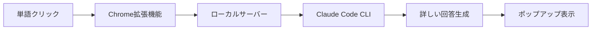

# Claude Code ローカルサーバーセットアップガイド

## 🚀 Claude Code（私）を使った本物のAI回答

ハードコードではなく、**実際のClaude Code（このCLIツール）**があなたの質問に答えます！

## セットアップ手順

### 1. Claude Codeのインストール確認

まず、Claude Codeがインストールされているか確認します：

```bash
claude --version
```

インストールされていない場合は、[公式ドキュメント](https://docs.anthropic.com/claude-code)を参照してください。

### 2. ローカルサーバーのセットアップ

新しいターミナルを開いて以下を実行：

```bash
# サーバーディレクトリに移動
cd ~/educont/server

# 依存関係をインストール（初回のみ）
npm install

# サーバーを起動
npm start
```

成功すると以下のメッセージが表示されます：
```
[Claude Code Server] ポート 3456 で起動しました
[Claude Code Server] YouTube動画の単語クリックを待機中...
```

### 3. Chrome拡張機能の設定

1. 拡張機能アイコンをクリック
2. **APIプロバイダー**で「Claude Code (ローカル)」を選択
3. 「保存」をクリック

### 4. 使用開始

1. YouTube動画を開く
2. 字幕の単語をクリック
3. Claude Code（私）が即座に詳しい説明を提供します！

## 動作の仕組み



## トラブルシューティング

### サーバーに接続できない

エラーメッセージが表示された場合：

1. サーバーが起動しているか確認
2. ポート3456が使用されていないか確認：
   ```bash
   lsof -i :3456
   ```
3. 必要に応じてサーバーを再起動

### Claude Codeが応答しない

1. Claude Codeが正しくインストールされているか確認
2. ターミナルで直接テスト：
   ```bash
   claude "テスト"
   ```

### 回答が遅い

Claude Codeは高品質な回答を生成するため、数秒かかる場合があります。

## 特徴

- ✅ **リアルタイムAI回答**: ハードコードではない本物の回答
- ✅ **文脈理解**: 前後10秒の字幕を考慮
- ✅ **ジャンル認識**: 動画の種類に応じた説明
- ✅ **即座の応答**: 新しいタブを開かない
- ✅ **完全ローカル**: APIキー不要

## セキュリティ

- ローカルサーバーは `localhost` からのみアクセス可能
- 外部ネットワークからはアクセスできません
- データは外部に送信されません

## 開発者向け情報

サーバーのログを確認：
```bash
# server/claude-code-server.js で詳細ログを確認
```

カスタマイズ：
- ポート変更: `server/claude-code-server.js` の `PORT` 変数
- タイムアウト調整: 同ファイルの `timeout` 設定