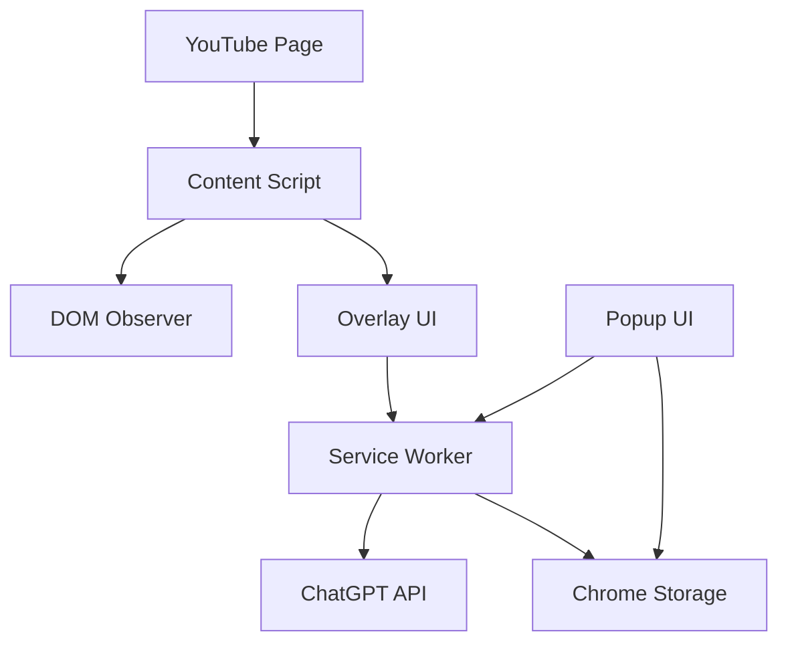

# 技術設計書 - YouTube学習支援拡張機能

## アーキテクチャ概要



## コンポーネント詳細

### 1. Content Script (`content/`)
**責務**: YouTubeページへのUI注入と制御

```typescript
// content/index.ts
- YouTube動画ページの検出
- 字幕データの取得
- オーバーレイUIの注入
- ユーザーインタラクションの処理
```

**主要機能**:
- `detectYouTubePage()`: 動画ページかどうか判定
- `extractCaptions()`: 字幕データ取得
- `injectOverlay()`: UI要素の注入
- `handleTextSelection()`: テキスト選択イベント

### 2. Service Worker (`background/`)
**責務**: API通信とデータ管理

```typescript
// background/service-worker.ts
- ChatGPT APIとの通信
- データのキャッシュ管理
- 拡張機能の状態管理
```

**主要機能**:
- `callChatGPT()`: API呼び出し
- `cacheResponse()`: レスポンスキャッシュ
- `manageRateLimit()`: レート制限管理

### 3. Overlay UI (`content/components/`)
**責務**: インタラクティブな字幕表示

```typescript
// content/components/TranscriptOverlay.tsx
interface TranscriptOverlayProps {
  captions: Caption[]
  currentTime: number
  onWordClick: (word: string, context: string) => void
}
```

**UIコンポーネント構成**:
- `TranscriptOverlay`: メインコンテナ
- `CaptionLine`: 各字幕行
- `ClickableWord`: クリック可能な単語
- `ExplanationPopup`: 説明ポップアップ

### 4. Popup UI (`popup/`)
**責務**: 拡張機能の設定と管理

```typescript
// popup/App.tsx
- APIキー設定
- 言語設定
- 学習履歴表示
- 機能のON/OFF
```

## データフロー

### 字幕取得フロー
```
1. YouTube動画ページ読み込み
2. Content Scriptが動画IDを検出
3. 字幕取得試行:
   a. YouTube Player APIから取得
   b. 失敗時: DOM解析で取得
   c. 最終手段: 外部API利用
4. 字幕データを構造化
5. UIに反映
```

### 質問・回答フロー
```
1. ユーザーが単語/フレーズをクリック
2. Content Script → Service Worker へメッセージ
3. Service Workerで質問文生成:
   - クリックした単語
   - 前後の文脈（2-3文）
   - 動画のタイトル
4. ChatGPT APIコール
5. レスポンスをContent Scriptへ
6. ポップアップで表示
```

## データ構造

### Caption Interface
```typescript
interface Caption {
  id: string
  startTime: number  // 秒
  endTime: number    // 秒
  text: string
  words?: Word[]     // 単語レベルのタイミング情報
}

interface Word {
  text: string
  startTime: number
  endTime: number
  offset: number     // 文中の位置
}
```

### Storage Structure
```typescript
interface StorageData {
  settings: {
    apiKey: string
    language: 'ja' | 'en' | 'auto'
    theme: 'light' | 'dark'
    overlayPosition: 'bottom' | 'top' | 'side'
  }
  history: {
    queries: QueryHistory[]
    savedExplanations: SavedExplanation[]
  }
  cache: {
    [key: string]: CachedResponse
  }
}
```

## セキュリティ考慮事項

1. **APIキーの保護**
   - 暗号化してローカルストレージに保存
   - コンテンツスクリプトからは直接アクセス不可

2. **CSP (Content Security Policy)**
   - YouTube のCSPに準拠
   - 動的スクリプト実行を避ける

3. **権限の最小化**
   - 必要な権限のみmanifestで要求
   - activeTabのみでyoutube.comに限定

## パフォーマンス最適化

1. **遅延読み込み**
   - 動画ページ以外では何も読み込まない
   - UIコンポーネントは必要時にのみ注入

2. **キャッシング戦略**
   - 同じ質問は24時間キャッシュ
   - 頻出単語の説明は事前キャッシュ

3. **バンドルサイズ**
   - Content Script: < 100KB
   - 全体: < 1MB

## エラーハンドリング

1. **字幕取得失敗**
   - フォールバック順序で再試行
   - ユーザーに手動入力オプション提供

2. **API制限**
   - レート制限の可視化
   - オフライン辞書へのフォールバック

3. **ネットワークエラー**
   - 自動リトライ（最大3回）
   - エラー内容をユーザーフレンドリーに表示